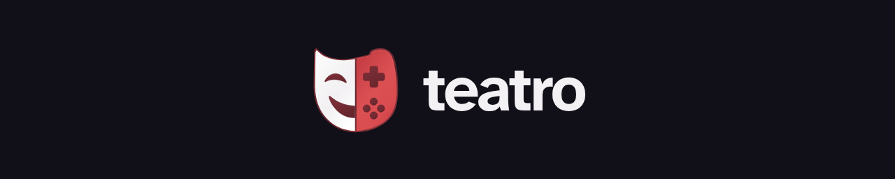

<h1 align="center">
  <a href="https://teatro.host/"></a>
</h1>

<p align="center">
  <a href="Cargo.toml"></a>
  <a href="#limits-and-release-status"></a>
  <a href="LICENSE"></a>
  <a href="docs/development.md#run-from-source"></a>
  <a href="https://github.com/users/lodilorenzo/packages/container/package/teatro"></a>
</p>

Teatro is a self-hosted game library server with a player library,
browser administration, and a focused ROMM-compatible API. SQLite stores the
catalog; game files remain visible on disk. Teatro does not supply games or run
emulators. Import only content you have permission to use.

Teatro is beta, noncommercial source-available software under
[CC BY-NC-SA 4.0](LICENSE). Docker is the main deployment method.
[Published beta images on GHCR](https://github.com/users/lodilorenzo/packages/container/package/teatro)
are available for Linux amd64 and arm64. No local compilation is needed.
There is no stable binary release. The current version is defined in
[`Cargo.toml`](Cargo.toml).

## Features

- Authenticated browsing, search, game details, covers and browser downloads.
- Uploads and managed-library scans for single files, optical-disc descriptors,
  tracks and multi-disc playlists.
- Metadata and cover editing, optional IGDB matching, and explicit file deletion.
- Read-only and administrator accounts, browser sessions and scoped API tokens.
- CRC32, MD5, SHA-1 and SHA-256 hashing with Logiqx XML DAT verification.
- Optional GOG offline-installer extraction into Windows ZIPs.
- Optional browsing and selected-game imports from one remote RomM server.
- Optional same-link IPv4 discovery for compatible clients.

## Quick start with Docker

Use a 64-bit Linux Docker engine, Compose v2, curl and local storage. Install a
[current Cosign release](https://docs.sigstore.dev/cosign/system_config/installation/)
to verify the image signature. You do not need Rust, BuildKit or a source checkout.

For a **fresh installation**, restrict port 4440 to your trusted network first.
Review the [beta security exceptions](docs/image-publication.md#known-findings-and-scanner-limits).
The example pins the image from this [successful publication run](https://github.com/lodilorenzo/teatro/actions/runs/35287351279)
and its matching Compose file. There is no `latest` tag.

```bash
set -euo pipefail
mkdir teatro
cd teatro
curl --fail --location --output docker-compose.yml \
  https://raw.githubusercontent.com/lodilorenzo/teatro/c713e1e7c53581a365fc3f2bbca6975ca6ded9d7/docker-compose.yml
export TEATRO_IMAGE=ghcr.io/lodilorenzo/teatro@sha256:9bbeb09704c57a6b3a3dc7b44feac4ee45a515adab3e68f800657ed6ac9fd3f8
cosign verify "$TEATRO_IMAGE" \
  --certificate-identity 'https://github.com/lodilorenzo/teatro/.github/workflows/docker.yml@refs/heads/main' \
  --certificate-oidc-issuer https://token.actions.githubusercontent.com
printf 'TEATRO_IMAGE=%s\n' "$TEATRO_IMAGE" > .env
docker compose config --quiet
docker compose pull
docker compose up --no-build -d
```

Docker selects the native architecture. Keep `.env` with your Compose file so
later commands keep using the verified image. For an existing deployment, follow
[upgrade and rollback](docs/docker.md#upgrade-and-rollback) instead of repeating
this fresh-install example.

Open `http://YOUR_SERVER:4440/setup` and immediately create the first administrator.
Then use `/` for the player library and `/admin` for administration. The default
named volume, `teatro-data`, holds the database, game files and covers.

**Complete setup on a trusted network. Do not expose port 4440 directly to the
Internet.** Passwords and tokens need HTTPS or a trusted VPN outside that boundary.
The default Compose file publishes the port on all host interfaces. For access
from the host only, set `TEATRO_HOST_PORT=127.0.0.1:4440` in a local Compose `.env`.

Read [Docker deployment](docs/docker.md) before using existing storage, changing
permissions, or upgrading. The public baseline supports fresh installations,
not databases from development snapshots with a different migration history.
To compile your own Docker image, see [build from source](docs/docker.md#build-from-source).
For a native build, see [development](docs/development.md#run-from-source).

## Documentation

All documentation is included here; no wiki is required.

| Guide | Covers |
| --- | --- |
| [Docker deployment and operations](docs/docker.md) | Installation, volumes, HTTPS, users, backup, restore, upgrades and troubleshooting. |
| [Library guide](docs/library.md) | Playing and downloading, uploads, scans, metadata, deletion, Jobs and integrity checks. |
| [Integrations](docs/integrations.md) | IGDB, GOG, remote RomM, compatible clients and LAN discovery. |
| [Configuration](docs/configuration.md) | Environment variables, defaults, limits and credential storage. |
| [API reference](docs/api.md) | Authentication, read/download contract and all management endpoint groups. |
| [Development](docs/development.md) | Source builds, checks and project structure. |
| [Beta image publication](docs/image-publication.md) | Native builds, security exceptions, SBOMs, signatures and publication gates. |
| [Security policy](SECURITY.md) | Supported versions and private vulnerability reporting. |

## Limits and release status

Teatro implements a subset of the ROMM API for browsing and downloads, not the full API.
GOG and remote RomM imports are disabled by default. Remote RomM compatibility
has not been validated against a live server. Server-side import jobs do not
resume after a restart. Archives are hashed as files, not by their members;
split archives and ClrMamePro text DATs are unsupported.

The Docker recipe and beta publishing workflow target native `linux/amd64` and
`linux/arm64` builds. Review the [image security policy](docs/image-publication.md)
before deployment. Stable-release qualification, production recovery,
independent reproducibility and client validation across devices remain pending.

## License and security

Teatro's original code, documentation and artwork are licensed under
[CC BY-NC-SA 4.0](LICENSE). Copyright © 2026 Lorenzo Lodi. This is noncommercial
source-available software, not OSI-approved open source.

Third-party material retains its own licenses. See
[THIRD_PARTY_NOTICES.md](THIRD_PARTY_NOTICES.md),
[RUST_DEPENDENCY_LICENSES.tsv](RUST_DEPENDENCY_LICENSES.tsv), notices beside the
web assets, and [packaging notices](packaging/THIRD_PARTY_NOTICES.md).
Source-publication review does not qualify generated images for redistribution.

Report vulnerabilities through the private route in [SECURITY.md](SECURITY.md).
Do not post exploit details, credentials or personal library data in public issues.
